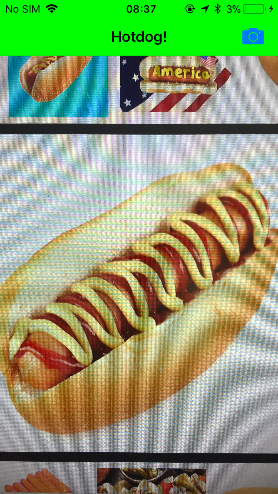

# SeeFood
SeeFood is an iOS app originally from Silicon Valley Season 4. It implemented CoreML and Google Inception v3 model to recognize
if the picture you taken is either a hotdog or not hotdog.

# Finished App

